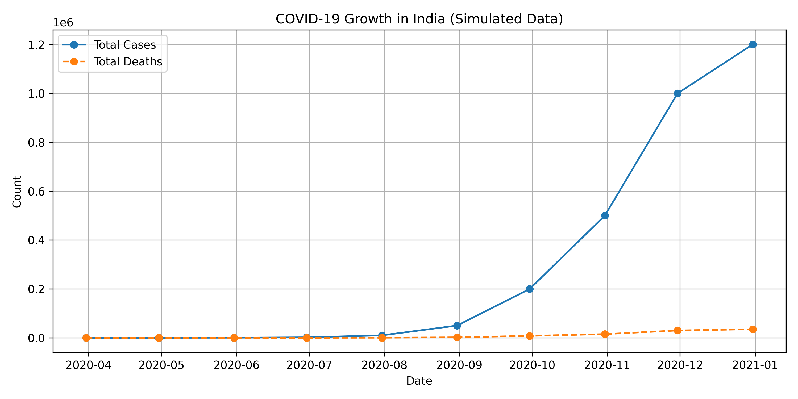

# Armaan Singh — Data Science Portfolio

Welcome to my Data Science portfolio!  
This repository contains my hands-on projects in data analysis, visualization, and real-world problem solving.

---

## Project 1 — Stock Market Analysis

**Goal:**  
Analyze and visualize stock price trends using simulated market data.

**Tools Used:**  
- Python (Pandas, Matplotlib)
- Jupyter Notebook

**Notes:**  
Originally designed to use live market data via `yfinance`,  
this version uses **sample data** to ensure it works fully offline.

**Preview:**  

---

## Project 2 — COVID-19 Dashboard

**Goal:**  
Track and visualize the growth of COVID-19 cases and deaths in India using simulated data.

**Tools Used:**  
- Python (Pandas, Matplotlib)
- Jupyter Notebook

**Preview:**  

---

## About Me

I’m a BCA student passionate about **data science, AI, and problem-solving**.  
My goal is to apply my analytical and programming skills to create real-world impact through data.

 **Contact:**  
- **GitHub:** [Armaan0885](https://github.com/Armaan0885)
- **Email:** (armaansinghgabbi641@gmail.com)

---
✨ *More projects coming soon!*
